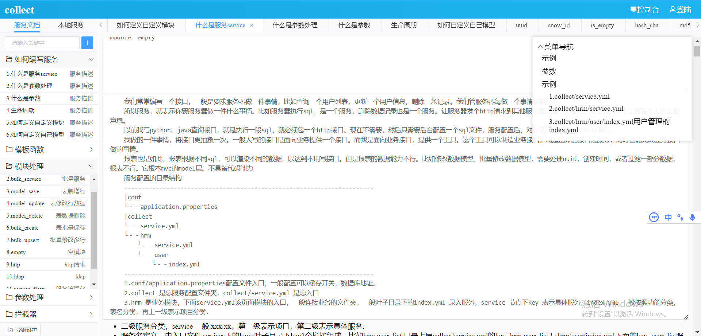

# 后台低代码配置 golang
http后台接口都可以配置，支持数据库增删改查，发http请求，shell等


    conf/application.properties示例中用sqlite ，为了方便连接数据库，不用搭建一个mysql,生产请换成mysql,其他数据库
## 示例
这是collect/version下简单接口示例。项目名为version,服务名为version。它对外返回一个雪花ID。基于模板生成了一个雪花ID,然后返回
```yaml
  - key: version
    http: true
    params:
      version:
        template: "{{snow_id}}"
        default: "1.0.0"
    handler_params:
      - key: param2result
        field: version
    module: empty
```
对/template_data/data。  发post的json的请求
```json
{
   "service": "version.version"
}
```
请求后返回
```json
{
	"status": 0,
	"count": 0,
	"success": true,
	"code": "0",
	"msg": "成功",
	"data": "271443343177682944"
}
```
## 描述

  我们常常编写一个接口，一般是要求服务器做一件事情，比如查询一个用户列表，更新一个用户信息，删除一条记录。我们管服务器每做一个事情叫做服务。
  
  所以服务，就表示你要服务器做一件什么事情。比如服务器执行sql，是一个服务，删除数据记录也是一个服务。让服务器发个http请求到其他服务器也是一个服务。服务划分这个主要看个人的主观意愿。
以前我写python、java查询接口，就是执行一段sql，就必须包一个http接口。现在不需要，然后只需要后台配置一个sql文件，服务配置后，对外就可以暴露一个http接口。
  
  我做的一件事情，将接口更抽象一次。一般人写的接口是面向业务提供一个接口。而我是面向业务接口，提供一个工具。这个工具可以制造业务接口，制造出来的接口是服务，同时也能完成业务接口做的事情。
  
  报表也是如此，报表根据不同sql，可以渲染不同的数据，以达到不用写接口。但是报表的数据能力不行。比如修改数据模型、批量修改数据模型，需要处理uuid，创建时间，或者过滤一部分数据，报表不行。它根本mvc的model层。不具备代码能力

服务配置的目录结构

    -----------------------------------------------------------------------
    |conf
    └－－application.properties
    |collect
    └－－service.yml
    └－－hrm
        └－－service.yml
        └－－user
            └－－index.yml
    -----------------------------------------------------------------------
    1.conf/application.properties配置文件入口，一般配置可以缓存开关，数据库地址。
    2.collect 是总服务配置文件夹，collect/service.yml 是总入口
    3.hrm 是业务模块，下面service.yml该页面模块的入口，一般连接业务的文件夹。一般叶子目录下的index.yml 录入服务，service 节点下key 表示具体服务，index.yml 一般按照功能分类，表名分类，再上一级表示项目分类.

## 要点

    1. 二级服务分类，service 一般 xxx.xx。第一级表示项目，第二级表示具体服务.
    2. 服务名定义，由入口文件services下的key+叶子目录下key2个拼接组成。比如hrm.user_list,是最上层collect/service.yml的key=hrm,user_list 是hrm/user/index.yml下面的key=user_list服务 。定义的时候就得保证唯一
    3. collect/service.yml 定义了所有模块、处理器。就是为了写配置的时候方便看一眼，有印象
## 启动服务
源代码模式运行
```cmd
go run main.go
```
或则点击moon.exe
```
浏览器打开 http://127.0.0.1:8009/console/static
```
访问会得到控制台地址
 http://127.0.0.1:8009/ssh


